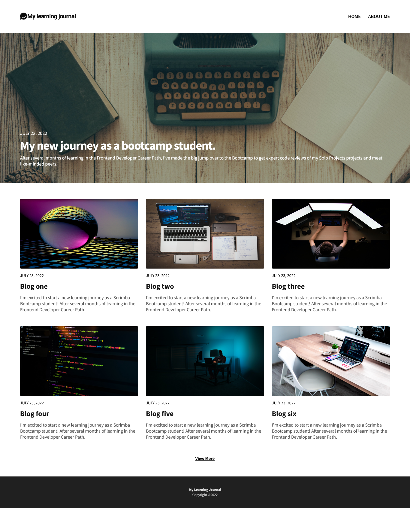

# Scrimba - Learning Journal solo project solution

This is a solution to the [Learning journal solo project challenge on Scrimab](https://www.scrimba.com).

## Table of contents

- [Overview](#overview)
  - [The challenge](#the-challenge)
  - [Screenshot](#screenshot)
  - [Links](#links)
- [My process](#my-process)
  - [Built with](#built-with)
  - [What I learned](#what-i-learned)
  - [Useful resources](#useful-resources)
- [Author](#author)

## Overview

### The challenge

Users should be able to:

- View the optimal layout for the interface depending on their device's screen size

### Screenshot

### Links

- Repo URL: [Add solution URL here](https://www.github.com/olakad13/learning_journal)
- Live Site URL: [Add live site URL here](https://olakad13.github.io/learning_journal/)

## My process

### Built with

- Semantic HTML5 markup
- CSS custom properties
- Flexbox
- CSS Grid
- SASS

### What I learned

I learnt how to use Css grid to build a fully responsive Webpage.

### Useful resources
The Scrimba's frontend career development path on www.scrimba.com helped me properly understand css grid and 
other relevant topics like css Animations, vanillas Js which was fundamental to the success of this project

## Author

- Name - [Kayode Olatunji]

